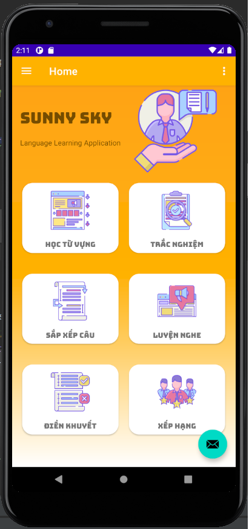

## Đề tài môn Công nghệ phần mềm
### Tên đề tài: Ứng dụng học ngôn ngữ
#### Nhóm thực hiện: Nhóm 5
#### Người thực hiện:
* Nguyễn Gia Huy - 18110121
* Huỳnh Nhựt Thiên - 18110203
* Vũ Đức Tuấn - 18110231
* Phạm Duy Lập - 18110143
#### Danh sách các yêu cầu của đề tài:
* Học từ vựng
* Điền khuyết từ
* Luyện nghe
* Trắc nghiệm
* Sắp xếp câu
* Xếp hạng
* Đổi mật khẩu
* Đăng nhập, đăng ký
* Thông tin tài khoản

### Hướng dẫn sử dụng
## Preview
:rocket: :rocket: :octocat:
`Home`

